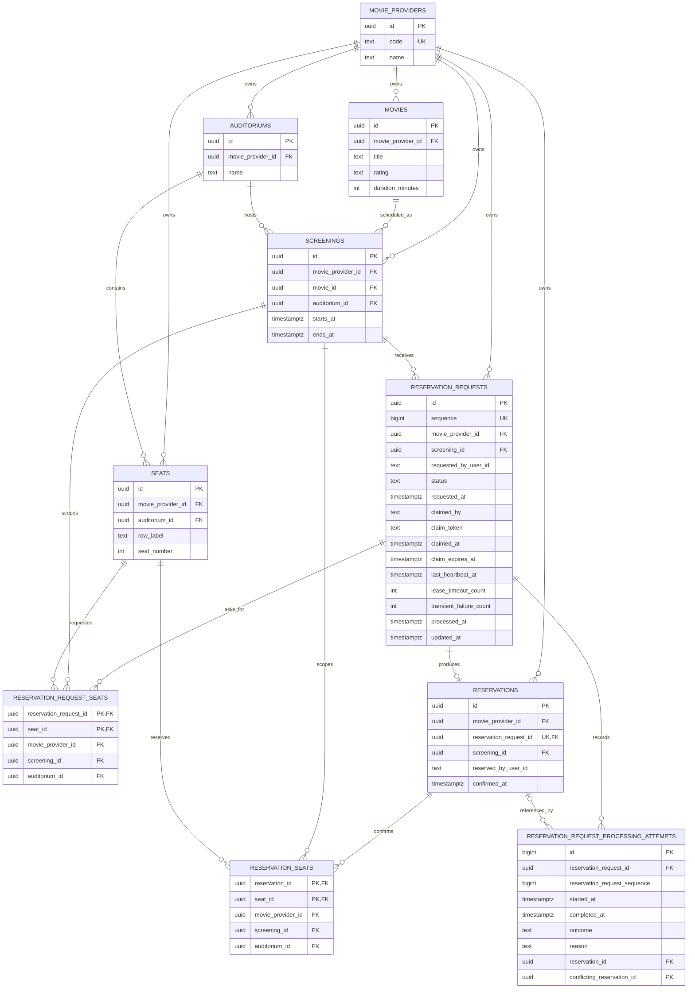

# Movie Reservation Database Schema

The source of truth for this schema is the Knex migration in
`movie-reservation-service/src/infrastructure/database/migrations/202605290001_create_movie_reservation_schema.ts`.
This document is a human-readable map of the current table relationships.

In production systems, documenting database tables and relationships is common
when the schema carries important business meaning or operational behavior. The
documentation should not replace migrations, database constraints, or generated
schema inspection. It should explain the relationships that matter to humans:
ownership boundaries, workflow tables, important uniqueness constraints, and
the reason a table exists.

For this service, the documentation is useful because the database is not only
storing entities. It also stores the reservation request workflow, worker claim
state, retry counters, processing attempts, and the seat-conflict guard that
prevents two confirmed reservations from taking the same seat for the same
screening.

## Relationship Diagram

## Notes

- `movie_provider_id` is the current tenant boundary. Many relationships use
  composite foreign keys that include `movie_provider_id` so records cannot
  accidentally connect across providers.
- `reservation_request_seats` captures the seats a user asked for before the
  request is processed.
- `reservations.reservation_request_id` is unique, so a reservation request can
  produce at most one confirmed reservation.
- `reservation_seats` has a unique constraint on `(screening_id, seat_id)`.
  That is the database-level guard against double-booking a confirmed seat for
  the same screening.
- `reservation_request_processing_attempts` is operational history. It records
  worker outcomes and can reference either the confirmed reservation or the
  conflicting reservation that caused a rejection.
