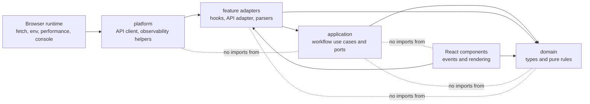
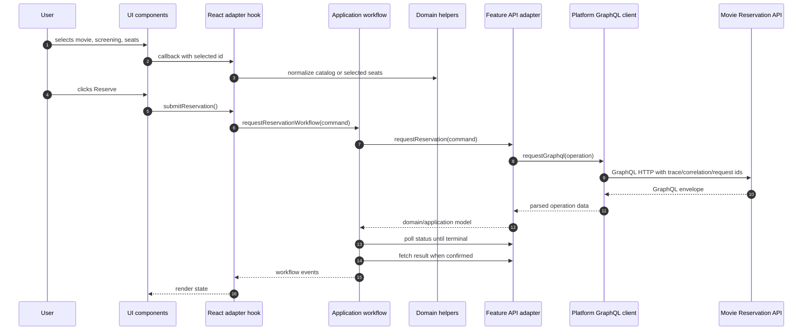

# Frontend Architecture

The `movie-reservation-web/` workspace is a React and Vite frontend for the
movie reservation workflow. It is intentionally smaller than the backend
service, but it still follows clean architecture boundaries where they help:
domain rules stay framework-free, use cases coordinate workflow behavior, and
React/browser details stay at the edge.

The goal is not to make browser code look like a backend service. The goal is
to keep important behavior testable without rendering React, while keeping UI
components focused on displaying state and raising user events.

## Layer Dependency Rule

Dependencies point inward:



Readable version:

```text
domain <- application <- adapters/hooks/API <- UI and platform runtime
```

Allowed direction examples:

- `ui/movie-reservation-demo.tsx` may import hooks from `adapters`.
- `adapters/use-reservation-workflow.ts` may call an application use case and
  domain helpers.
- `application/request-reservation-workflow.ts` may depend on the
  `MovieReservationApi` port, but not on React or `fetch`.
- `adapters/movie-reservation-api.ts` may implement that port through
  `platform/api/graphql-client.ts`.
- `domain/catalog-selection.ts` must stay plain TypeScript.

Forbidden direction examples:

- `domain` must not import React, browser APIs, GraphQL clients, or platform
  helpers.
- `application` must not import React hooks, Vite env, `fetch`, or platform
  modules.
- UI components should not parse GraphQL responses or decide catalog
  normalization rules.

## Workspace Folder Structure

Current shape:

```text
movie-reservation-web/
  env_files/
    templates/
      local/
        local-dev.env.template
    local/
      local-dev.env              # rendered locally, ignored by git
  src/
    app/
      app.tsx
    features/
      movie-reservations/
        domain/
        application/
        adapters/
        ui/
    platform/
      api/
      observability/
    main.tsx
    styles.css
```

### `src/app`

Application composition for the browser app.

Use this for:

- root app component;
- future top-level providers;
- future router composition if routing is added.

Do not put feature rules or GraphQL operation details here.

### `src/features/movie-reservations/domain`

Framework-free movie reservation rules and types.

Current examples:

- catalog selection normalization;
- reservation status classification;
- selected-seat filtering;
- domain-facing types such as `Movie`, `Screening`, `Seat`,
  `ReservationRequest`, and `Reservation`.

This layer is closest to Rust-style pure functions: inputs come in, outputs go
out, and there are no browser side effects. TypeScript checks the shape at
compile time, but runtime data still needs validation in adapters.

### `src/features/movie-reservations/application`

Workflow use cases and feature-owned ports.

Current examples:

- `request-reservation-workflow.ts` coordinates the command, polling, terminal
  status handling, and result lookup.
- `movie-reservation-api.ts` defines the `MovieReservationApi` port used by the
  workflow.

Application code can depend on domain types and ports. It should not know
whether the API is GraphQL, REST, mocked, or backed by browser `fetch`.

### `src/features/movie-reservations/adapters`

Adapters connect the application feature to React and external systems.

Current examples:

- React controller hooks such as `use-movie-catalog.ts` and
  `use-reservation-workflow.ts`;
- GraphQL operation adapter in `movie-reservation-api.ts`;
- runtime response parsers in `movie-reservation-api-parsers.ts`;
- local user-facing error mapping.

Adapters are allowed to know about React hooks, GraphQL operation strings,
runtime validation, and platform API clients. They should translate external
details into application/domain models before UI code sees them.

### `src/features/movie-reservations/ui`

Humble React components for rendering and user interaction.

Current examples:

- catalog panel;
- screening panel;
- seat map;
- reservation panel;
- diagnostics panel.

UI components should receive data and callbacks. They can do display formatting
and small memoization for rendering, but business rules should move into
domain/application code when they affect behavior.

### `src/platform`

Application-wide browser/runtime integrations.

Current examples:

- `platform/api/graphql-client.ts` owns generic GraphQL transport behavior,
  observability headers, operation names, and dev-only bearer-token handling.
- `platform/observability/trace-context.ts` owns trace/correlation/request id
  construction.

`platform` is deliberately not named `shared`, `utils`, or `helpers`. The name
means "cross-cutting runtime capability", not "anything reusable". Feature
domain/application code should not import `platform`; adapters may.

## Data Flow



## Runtime Validation Boundary

The backend response is untrusted runtime data when it enters the browser.
TypeScript types do not validate JSON at runtime.

The current boundary is:

```text
fetch response text
  -> platform GraphQL envelope parsing
  -> feature operation parser
  -> domain/application model
  -> UI props
```

This is similar to parsing external input in Python with Pydantic or in Rust
with `serde`: the type becomes trustworthy only after the boundary parser has
checked the runtime value.

## Tests

Frontend unit tests are colocated with the code they protect:

```text
domain/movie-reservation-domain.test.ts
application/request-reservation-workflow.test.ts
adapters/movie-reservation-api-parsers.test.ts
platform/api/graphql-client.test.ts
platform/observability/trace-context.test.ts
```

This is intentional for the frontend. The tests are small, direct unit tests for
plain TypeScript modules and boundary helpers, so colocating them makes behavior
easy to find during refactors.

Use a separate test tree later for different test categories:

- Playwright browser tests;
- frontend/backend e2e tests;
- visual or accessibility smoke checks;
- shared test factories once duplication is real.

## Environment Files

The frontend follows the same convention as the backend service:

- committed templates live under `env_files/templates/**`;
- rendered local env files live under `env_files/local/**`;
- rendered `.env` files are ignored by git.

Current frontend template:

```text
movie-reservation-web/env_files/templates/local/local-dev.env.template
```

Current rendered local file:

```text
movie-reservation-web/env_files/local/local-dev.env
```

`VITE_*` values are visible to browser code. They are configuration, not
secrets. `VITE_DEMO_BEARER_TOKEN` is local-dev only and is ignored outside Vite
dev mode by the GraphQL client.

## Follow-Up Direction

Known future work:

- Add Playwright browser smoke tests under the #27/#31 follow-up path.
- Redesign catalog reads under #29 so initial load does not fetch every nested
  seat for every screening.
- Add frontend/backend e2e and scalable monorepo CI strategy under #31.
- Add production-shaped frontend OIDC/PKCE auth in a later auth hardening task.
- Add request aborts/timeouts and local-only failure demonstrations in a future
  resilience task.
