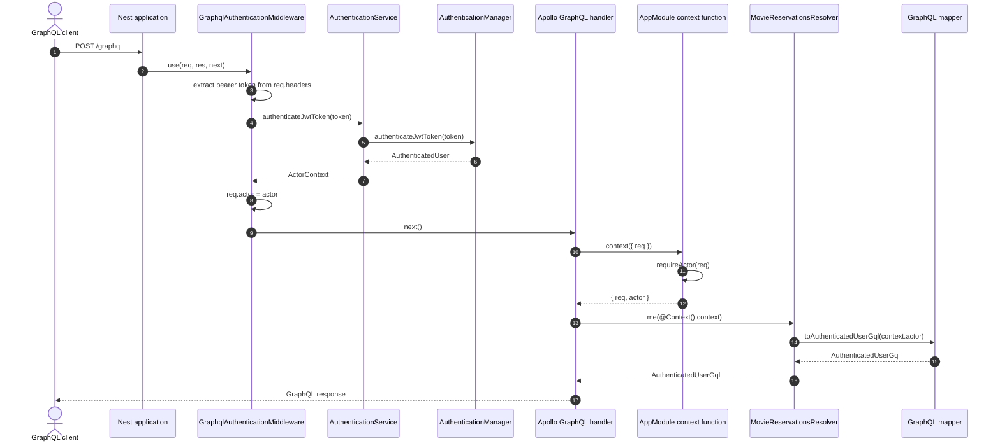
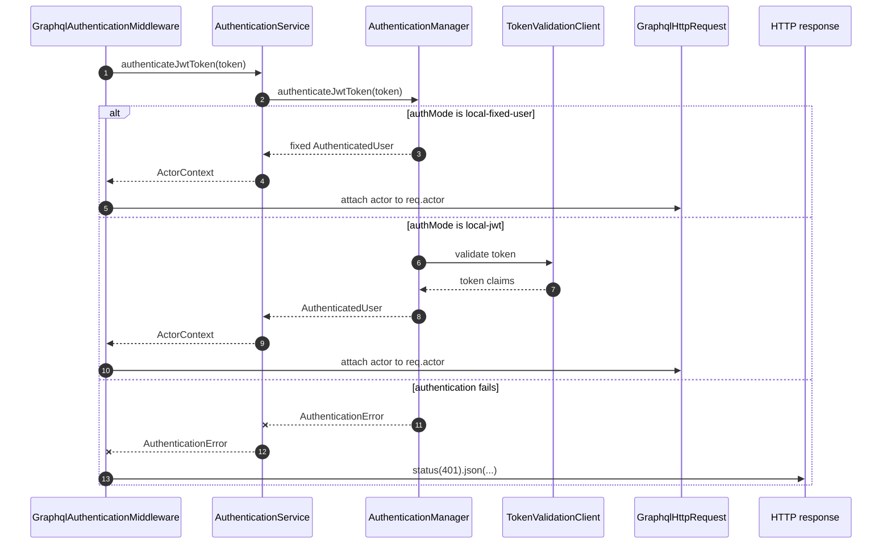
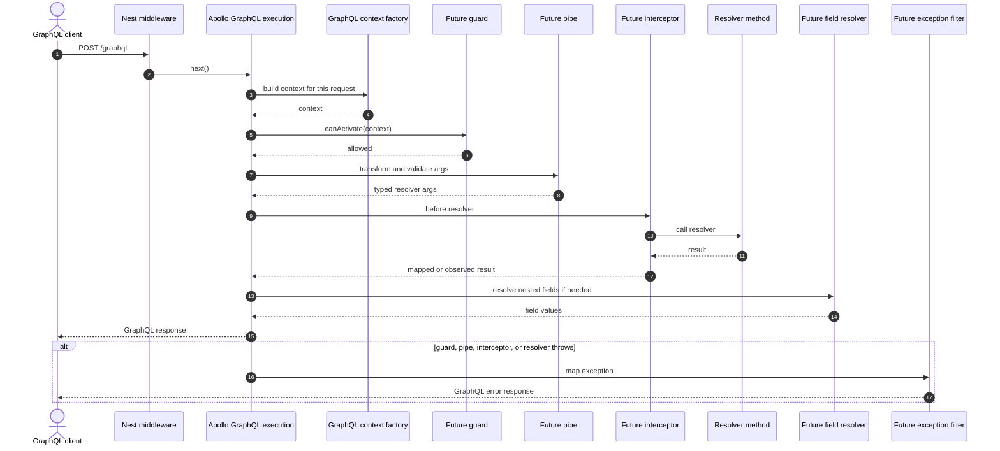
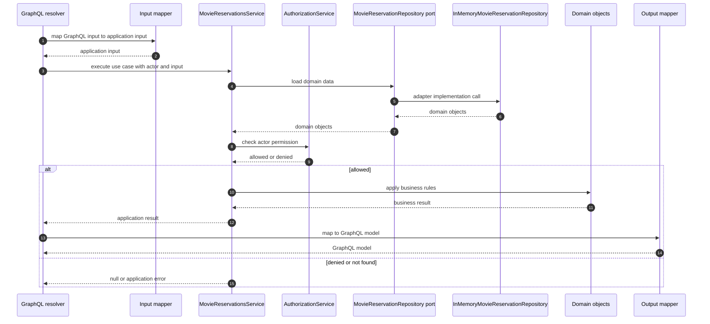

# GraphQL Request Flow

This note shows how a GraphQL request moves through the current
`movie-reservation-service/` codebase.

The important mental model is:

- NestJS and Apollo own the transport/framework path.
- The resolver is the presentation boundary.
- The resolver calls application services.
- Application services coordinate domain rules and infrastructure ports.
- Infrastructure adapters implement those ports.

## Current Request Sequence

This is the current happy path for a GraphQL request such as `query { me { id } }`.



Current code anchors:

- `src/app.ts` creates the Nest application.
- `src/app.module.ts` registers `GraphQLModule.forRoot(...)` and the GraphQL
  `context` function.
- `src/presentation/graphql/movie-reservations-graphql.module.ts` applies
  `GraphqlAuthenticationMiddleware` to the `graphql` route.
- `src/presentation/graphql/graphql-authentication.middleware.ts` reads the
  bearer token and attaches `req.actor`.
- `src/presentation/graphql/graphql-context.ts` defines the request and GraphQL
  context shapes.
- `src/presentation/graphql/movie-reservations.resolver.ts` receives the context
  through `@Context()`.

## Authentication Branches

The middleware does not authenticate the request by itself. It delegates to the
application authentication service, and that service delegates to the configured
authentication manager.



The key learning point: TypeScript says `req.actor` may exist, but only runtime
code can actually put the actor there. The middleware is the runtime step that
does it.

## Framework Extension Sequence

The service is intentionally small right now. This diagram shows the current
path plus the likely places where framework-side behavior can be added later.



Current status of those extension points:

- Middleware exists today for authentication.
- The GraphQL context factory exists today and copies `req.actor` into
  resolver-friendly context.
- Guards, pipes, interceptors, exception filters, and field middleware are shown
  as future extension points. They are not part of the current request path yet.

## Context Function

In `AppModule`, the context function is registered with Apollo through Nest:

```ts
context: ({ req }: { req: GraphqlHttpRequest }): MovieReservationGraphqlContext => ({
  req,
  actor: requireActor(req),
}),
```

Apollo calls that function while handling each GraphQL request. Conceptually, it
is similar to:

```ts
const context = gqlContext({ req: incomingHttpRequest });
```

That means:

- The input object must have a `req` property.
- `req` is typed as `GraphqlHttpRequest`.
- The middleware must already have attached `req.actor`.
- `requireActor(req)` is a runtime guard. If `req.actor` is missing, the request
  fails instead of silently creating an invalid context.
- The returned `MovieReservationGraphqlContext` is what resolvers receive through
  `@Context()`.

This is similar in spirit to a Strawberry/FastAPI `context_getter`: it builds a
per-request context object that GraphQL resolvers can use.

## Clean Architecture Business Sequence

This is the shape business requests should follow after Apollo has selected the
resolver. The current `me` query only maps `context.actor`, but movie and
reservation operations should flow through the application layer like this.



The outer layers are allowed to know about inner layers. Inner layers should not
know about NestJS, Apollo, HTTP, databases, or queues.

In practice:

- Presentation code translates GraphQL details into application calls.
- Application code coordinates use cases and ports.
- Domain code holds business concepts and rules.
- Infrastructure code implements application ports.
- DI composition decides which infrastructure implementation is plugged in.

## Reading The Flow In Practice

For a request like:

```graphql
query {
  me {
    id
    roles
  }
}
```

The current path is:

1. The client sends `POST /graphql`.
2. Nest runs `GraphqlAuthenticationMiddleware` for the `graphql` route.
3. The middleware extracts the bearer token and calls `AuthenticationService`.
4. `AuthenticationService` delegates to the configured authentication manager.
5. The middleware stores the result on `req.actor`.
6. Apollo calls the configured context function.
7. The context function returns `{ req, actor }`.
8. `MovieReservationsResolver.me()` receives that context through `@Context()`.
9. The resolver maps `context.actor` to the GraphQL response model.

As more business operations are added, step 9 should stay thin: the resolver
should map GraphQL input, call an application service, then map the application
result back to GraphQL output.
