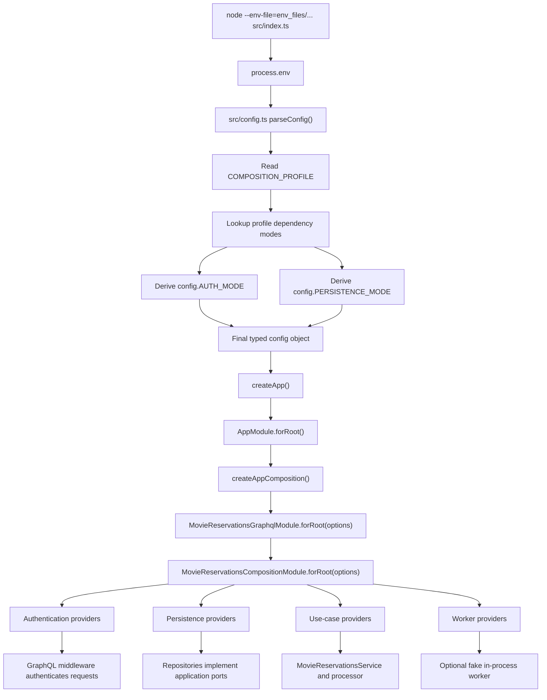
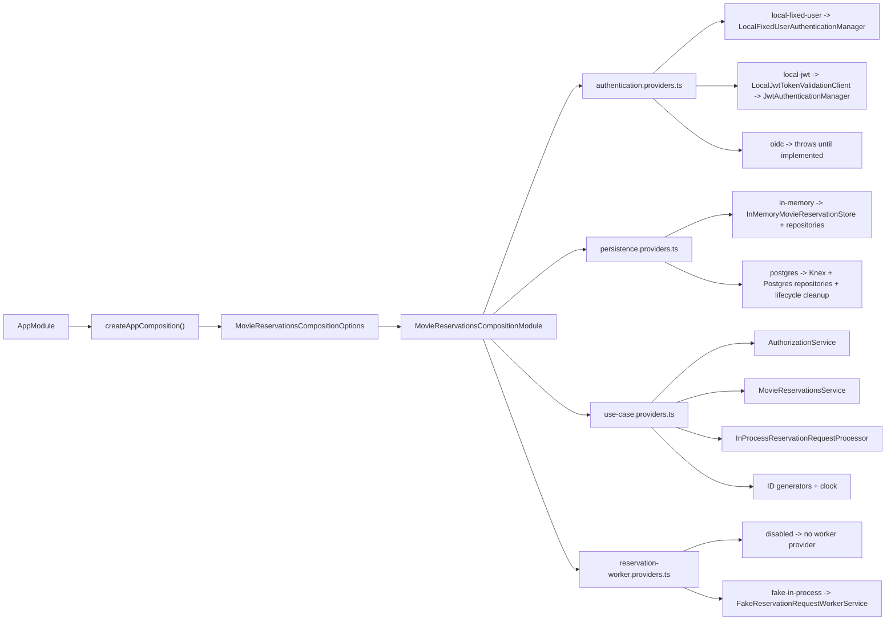
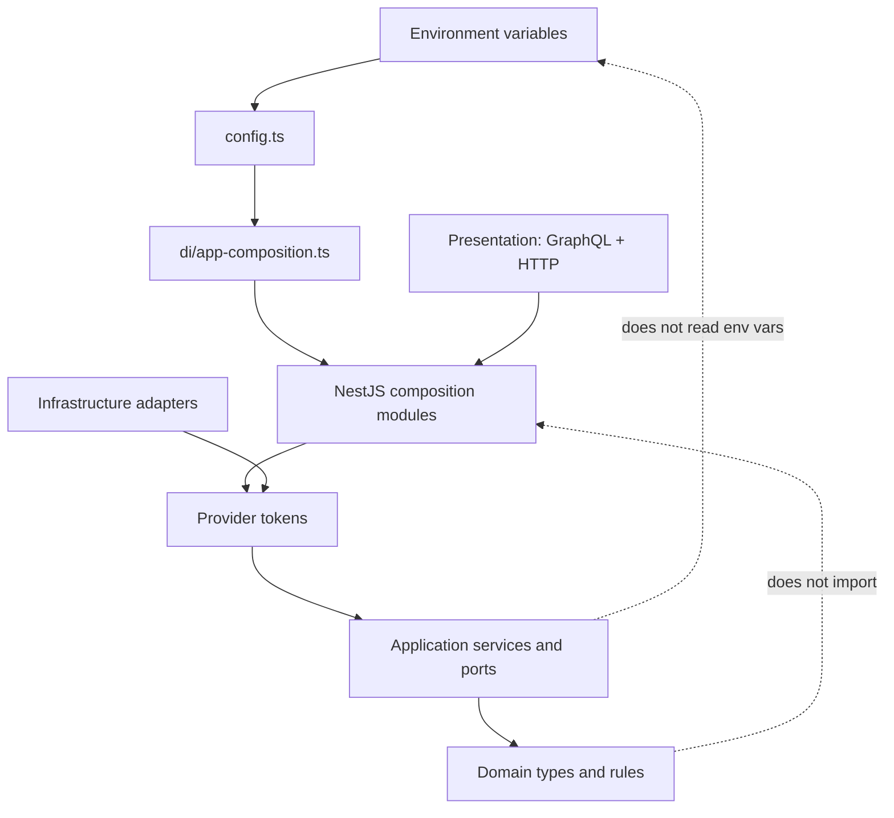

# Service DI Composition

This document explains how the NestJS service selects runtime dependency wiring
from environment configuration and how that wiring reaches the application
services.

The key rule is:

```text
Environment selects COMPOSITION_PROFILE.
COMPOSITION_PROFILE derives auth and persistence modes.
NestJS composition code turns those modes into providers.
Application and domain code stay unaware of env vars and NestJS modules.
```

## Runtime Configuration Flow



`AUTH_MODE` and `PERSISTENCE_MODE` are internal parsed config fields. They are
not intended to be set in env files. If stale env files still include them,
`src/config.ts` ignores those lower-level inputs because the selected
`COMPOSITION_PROFILE` owns those decisions.

## Composition Profiles

```text
COMPOSITION_PROFILE
  local-fixed-user  -> AUTH_MODE=local-fixed-user, PERSISTENCE_MODE=in-memory
  local-jwt         -> AUTH_MODE=local-jwt,        PERSISTENCE_MODE=in-memory
  local-postgres    -> AUTH_MODE=local-fixed-user, PERSISTENCE_MODE=postgres
  production-oidc   -> AUTH_MODE=oidc,            PERSISTENCE_MODE=postgres
```

The lower-level values are still useful to TypeScript code because provider
factories should not need to re-interpret profile names. The important
distinction is:

- env input: `COMPOSITION_PROFILE`
- derived typed config: `AUTH_MODE`, `PERSISTENCE_MODE`
- independent runtime setting: `RESERVATION_WORKER_MODE`

`RESERVATION_WORKER_MODE` stays separate because worker lifecycle is not the
same decision as auth or repository selection. For example, local Postgres can
run with the fake worker enabled for manual polling workflows, while tests can
run the same Postgres profile with the worker disabled and drive the processor
deterministically.

## Provider Wiring



This shape is similar in spirit to the Python `svcs` registrar pattern: a
selected profile chooses a coherent set of registrations. The TypeScript/NestJS
version keeps the selection finite and type-checked instead of using an env var
that points to an arbitrary import path.

## Layer Boundary



The dependency direction stays inward:

- Presentation and composition know about NestJS.
- Infrastructure adapters implement application ports.
- Application services depend on ports and domain types.
- Domain types do not know about NestJS, env vars, databases, GraphQL, or worker
  lifecycle.

## Main Files

- `movie-reservation-service/src/config.ts` parses env input, validates startup
  rules, and derives auth/persistence modes from `COMPOSITION_PROFILE`.
- `movie-reservation-service/src/di/app-composition.ts` maps parsed config or
  test overrides into feature module options.
- `movie-reservation-service/src/app.module.ts` imports framework modules and
  passes movie reservation composition options to the GraphQL module.
- `movie-reservation-service/src/presentation/graphql/movie-reservations-graphql.module.ts`
  wires GraphQL middleware and resolver classes to the feature composition
  module.
- `movie-reservation-service/src/di/movie-reservations/movie-reservations-composition.module.ts`
  composes focused provider groups and exports the application-facing services
  and tokens.
- `movie-reservation-service/src/di/movie-reservations/*.providers.ts` contains
  the focused provider groups for authentication, persistence, use cases, and
  worker lifecycle.

## Review Checklist

- Env templates set `COMPOSITION_PROFILE`, not `AUTH_MODE` or
  `PERSISTENCE_MODE`.
- `src/config.ts` derives `AUTH_MODE` and `PERSISTENCE_MODE` from
  `COMPOSITION_PROFILE`.
- New profiles are added to the finite profile map before they are used in env
  files.
- Provider choices stay in `di/`, not in resolvers, controllers, application
  services, or domain objects.
- Tests can still override focused composition options through
  `AppModule.forRoot(...)` or `createAppComposition(...)` without changing env
  files.
