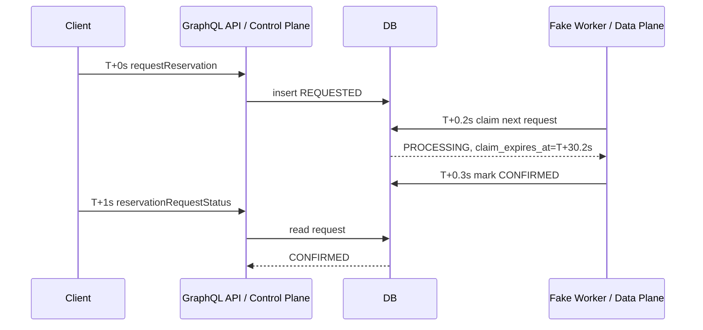
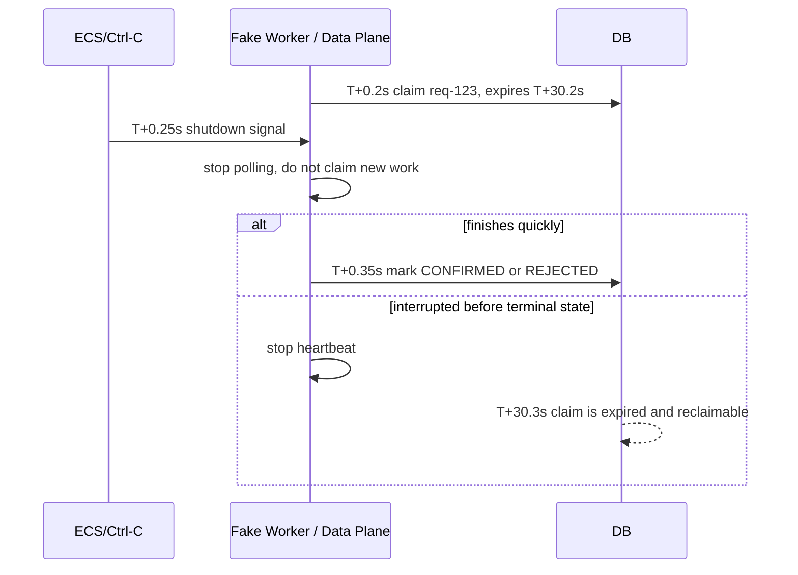
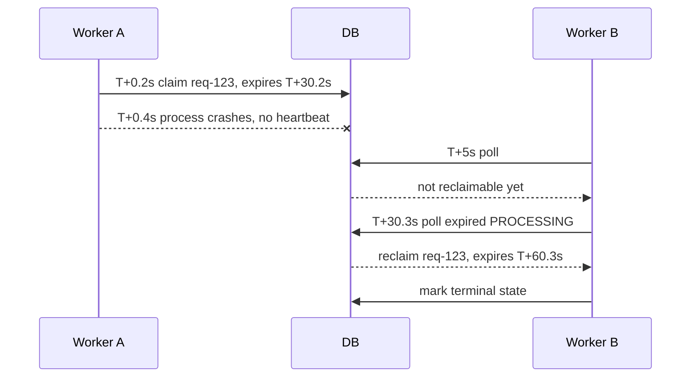
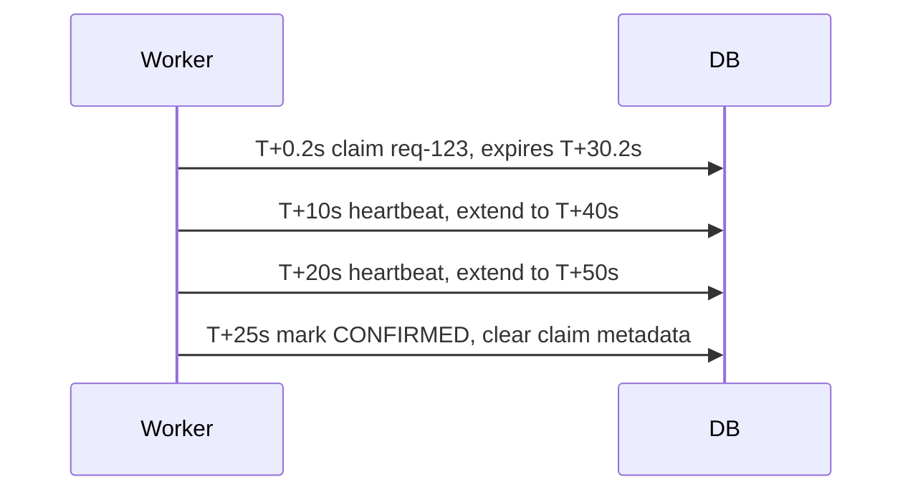

# Implementation Plan: D6.1 Review Findings

## 1. Summary

D6.1 addresses the most important findings from the read-only review of the D6
Postgres/Knex work while preserving the learning shape of the project.

The recommended approach is to keep D6.1 focused on making the current design
honest and safer:

- add a deterministic fake in-process reservation worker for both in-memory and
  Postgres modes;
- model worker leases, heartbeats, reclaim, and bounded retries in a small way;
- keep the business state machine simple;
- preserve the conceptual control-plane/data-plane split without creating a
  separate worker package yet;
- harden the obvious Postgres query, validation, and relational-invariant gaps;
- make local development safer by binding services to localhost;
- document accepted short-term tradeoffs and follow-ups.

D6.1 is not a production worker implementation. It is a bridge from the current
incomplete async feature toward a future decoupled worker/runtime design.

## 2. Goals

- Make reservation requests complete deterministically in local/service runtime
  through a fake in-process worker.
- Support the fake worker for both `in-memory` and `postgres` persistence modes.
- Add minimal lease, heartbeat, reclaim, and bounded retry semantics.
- Keep worker concurrency fixed at `1` for deterministic behavior.
- Preserve and document the conceptual split between the GraphQL control plane
  and reservation-processing data plane.
- Keep the current GraphQL API contract unchanged.
- Improve the `screenings` query shape without adding pagination or changing the
  schema contract.
- Validate only requested seats instead of loading the whole auditorium during
  `requestReservation`.
- Strengthen critical Postgres relational invariants that the application
  already assumes.
- Refactor the Postgres adapter enough that D6.1 worker and query changes remain
  readable.
- Bind local GraphQL and Postgres services to localhost by default.
- Replace opaque raw UUID usage in tests/docs with semantic aliases where
  practical.
- Add focused tests for D6.1 behavior.
- Record accepted deferrals and follow-ups clearly.

## 3. Non-goals

- Do not build a production-grade worker runtime.
- Do not introduce SQS, Redis, Temporal, Kafka, BullMQ, or any new queue
  technology.
- Do not create a separate npm workspace/package for the reservation worker in
  D6.1.
- Do not perform the full DI composition/profile refactor in this branch.
- Do not redesign the GraphQL polling API or replace nullable reads with unions.
- Do not add pagination/date-window arguments to `screenings` in D6.1.
- Do not replace the logging stack with Pino or structured logging.
- Do not add D7 dependency-health/observability endpoints.
- Do not add broad migration/seed CLI smoke tests unless they naturally fall out
  of the existing Postgres e2e migration path.
- Do not move local Postgres credentials into secrets in D6.1.

## 4. Current State

The D6 branch adds Docker Compose Postgres, Knex migrations, Postgres repository
adapters, local Postgres env profiles, and Testcontainers-oriented e2e tests.

Relevant current files:

- `movie-reservation-service/src/domain/movie-reservations/reservation-request-status.ts`
  defines `REQUESTED`, `PROCESSING`, `CONFIRMED`, `REJECTED`, and `FAILED`.
- `movie-reservation-service/src/application/movie-reservations/movie-reservations.service.ts`
  is the GraphQL/control-plane application service. It creates reservation
  requests and reads request/result state.
- `movie-reservation-service/src/application/movie-reservations/in-process-reservation-request-processor.ts`
  can process one pending request when directly invoked, but no runtime loop
  currently invokes it in the app.
- `movie-reservation-service/src/application/movie-reservations/ports/movie-reservation-repository.ts`
  is the control-plane persistence port.
- `movie-reservation-service/src/application/movie-reservations/ports/reservation-request-work-repository.ts`
  is the worker/data-plane persistence port.
- `movie-reservation-service/src/infrastructure/repositories/postgres/postgres-reservation-request-work.repository.ts`
  claims `REQUESTED` rows and marks them `PROCESSING`, but currently has no
  lease, heartbeat, reclaim, or retry model.
- `movie-reservation-service/src/infrastructure/database/migrations/202605290001_create_movie_reservation_schema.ts`
  creates the D6 schema and confirmed-seat uniqueness guard.
- `movie-reservation-service/src/presentation/graphql/movie-reservations.resolver.ts`
  fetches screenings and then loads seats per screening.
- `movie-reservation-service/src/config.ts` parses env at import time.
- `movie-reservation-service/src/app.ts` does not currently enable Nest shutdown
  hooks.
- `docker-compose.yml` publishes Postgres on `5432:5432`.
- `docs/plans/service-follow-up-tasks.md` already tracks larger follow-ups for
  DI composition, observability/logging, authorization, read contracts,
  persistence, and runtime lifecycle.

The review agents agreed on several high-value issues:

- async reservation requests do not complete in the running app;
- `PROCESSING` work can be stranded after crash or shutdown;
- `screenings` has an N+1 query shape and unbounded payload growth;
- config/DI wiring is becoming brittle;
- local dev exposes admin-capable GraphQL and Postgres broadly;
- Postgres relational invariants need tightening;
- worker lifecycle and Knex shutdown need proper Nest lifecycle wiring.

## 5. Requirements and Assumptions

### Confirmed Requirements

- D6.1 will add a fake in-process worker, not a real production worker.
- The fake worker runs for both in-memory and Postgres persistence modes.
- The fake worker can auto-run with the app when configured.
- The fake worker is deterministic, lean, and concurrency `1`.
- Worker behavior uses small env-backed config:
  - `RESERVATION_WORKER_MODE=disabled|fake-in-process`
  - `RESERVATION_WORKER_POLL_INTERVAL_MS`
  - `RESERVATION_WORKER_LEASE_MS`
  - `RESERVATION_WORKER_HEARTBEAT_INTERVAL_MS`
  - `RESERVATION_WORKER_MAX_LEASE_TIMEOUTS`
  - `RESERVATION_WORKER_MAX_TRANSIENT_FAILURES`
- D6.1 keeps the business state machine as:
  - `REQUESTED`
  - `PROCESSING`
  - `CONFIRMED`
  - `REJECTED`
  - `FAILED`
- D6.1 does not add finer-grained public/business states such as `CLAIMED`,
  `VALIDATING`, or `CONFIRMING`.
- Worker lifecycle details are represented as metadata, not extra business
  states:
  - `claimed_by`
  - `claimed_at`
  - `claim_expires_at`
  - `last_heartbeat_at`
  - `lease_timeout_count`
  - `transient_failure_count`
- Seat conflicts remain terminal `REJECTED` and are not retried.
- Unexpected internal failures get small bounded retries, then terminal `FAILED`.
- The current `unexpected-error` bucket is treated as a retryable transient
  failure in D6.1. A later durable-worker phase should replace this coarse
  catch-all with explicit retryable and non-retryable exception classification.
- The current GraphQL API contract stays unchanged.
- The current logging behavior is an accepted short-term tradeoff and is
  deferred to the observability/logging follow-up.
- `/ready` remains simple in D6.1; dependency/business readiness is deferred to
  D7 observability.
- Local GraphQL and Postgres bind to localhost by default.
- Predictable local Postgres credentials remain temporarily acceptable after
  localhost binding.

### Assumptions

- The worker can be implemented inside the current service workspace without
  changing package boundaries.
- Tests can use short worker intervals and leases without making production-like
  defaults unsafe.
- The existing `ReservationRequestWorkRepository` split is the right place to
  model worker claim, heartbeat, reclaim, retry, and terminal transitions.
- Postgres migration changes are acceptable because D6 is not yet a production
  deployed schema.
- The D6 branch can still update tests, docs, and seed/demo ID usage.

### Open Questions

- Exact default worker timings can be finalized during implementation. Suggested
  starting values:
  - lease: `30s`
  - heartbeat: `10s`
  - poll interval: `250ms` or a similarly small deterministic local value
  - max lease timeouts: `3`
  - max transient failures: `3`
- Exact DB column names can be finalized during implementation, but should be
  explicit and readable.
- Whether local Postgres credentials should be moved to an untracked secret file
  is a follow-up, not a D6.1 blocker.

## 6. Proposed Design

### Control Plane and Data Plane

Treat the GraphQL API and worker as conceptually separate even though D6.1 keeps
them in one Nest process.

Control plane responsibilities:

- accept GraphQL reservation commands;
- create reservation request rows;
- read request status and reservation results;
- enforce caller-visible authorization semantics;
- depend on `MovieReservationRepository`.

Data plane responsibilities:

- claim reservation work;
- heartbeat and renew leases;
- process seat conflicts and confirmations;
- write terminal request states and processing attempts;
- depend on `ReservationRequestWorkRepository`.

This mirrors the direction used in
`/home/patex1987/development/python-agent-with-idp`, where the worker side has a
separate consumer/lease/store shape. D6.1 should borrow the boundary idea, not
the full implementation complexity.

### Worker Runtime Placement

Use a conceptual split inside the current service:

- Keep `InProcessReservationRequestProcessor` as the plain TypeScript
  application orchestrator.
- Add a small worker runtime/lifecycle adapter at the Nest edge. This adapter
  owns polling, timers, shutdown, and calling the processor.
- Keep worker-specific persistence behavior behind
  `ReservationRequestWorkRepository`.
- Add docstrings/comments explaining that this fake worker is a local data-plane
  adapter and may later move into a separate package/process/service.

Do not create a separate worker workspace/package in D6.1.

### Worker State and Lease Model

Keep business state simple:

```text
REQUESTED -> PROCESSING -> CONFIRMED
                      \-> REJECTED
                      \-> FAILED
```

Add worker metadata to durable work records:

```text
status=PROCESSING
claimed_by=fake-worker-1
claimed_at=T+0.2s
claim_expires_at=T+30.2s
last_heartbeat_at=T+10.2s
lease_timeout_count=0
transient_failure_count=0
```

Claiming should select the oldest eligible request:

- `REQUESTED` with transient failure budget remaining; or
- expired `PROCESSING` with lease timeout budget remaining.

Heartbeat should renew only if the current worker still owns the claim. If the
claim is lost or terminal, heartbeat should stop the current execution path from
continuing to terminal writes.

Retries are bounded:

- seat conflict: terminal `REJECTED`;
- unexpected processor failure: retry under `transient_failure_count` until
  `RESERVATION_WORKER_MAX_TRANSIENT_FAILURES`, then terminal `FAILED`;
- crashed/shutdown worker: reclaim after `claim_expires_at` and increment
  `lease_timeout_count` until `RESERVATION_WORKER_MAX_LEASE_TIMEOUTS`, then
  terminal `FAILED`.

Failure scenarios worth documenting and testing:

- a worker claims work and the ECS task is killed during deploy or scale-in;
- the Node process crashes or the container is OOM-killed after claiming;
- a blocked event loop, CPU throttling, or overload prevents heartbeats;
- Postgres restart/failover breaks the active connection or transaction;
- a future external dependency call hangs longer than the lease;
- a future transient dependency failure such as a deadlock, serialization
  failure, connection reset, rate limit, or temporary 503 should be retried only
  after explicit classification.

### Lifecycle and Shutdown

Enable Nest shutdown hooks so owned resources receive lifecycle callbacks.

On shutdown:

- the worker stops polling;
- the worker does not claim new requests;
- in-flight work may finish if it is quick;
- otherwise heartbeat stops and lease expiry/reclaim handles recovery;
- Knex cleanup runs through Nest lifecycle.

### Worker Flow Examples

Normal flow:



Graceful shutdown:



Crash and reclaim:



Heartbeat:



### Query Shape Improvements

Improve `screenings(movieId)` without changing the GraphQL contract:

- push optional `movieId` filtering into the repository/application boundary;
- add a batch seat-loading path so one resolver call does not run one seat query
  per screening;
- keep the current inline `Screening.seats` response shape;
- document this as interim, not the final read-model/pagination solution.

### Targeted Seat Validation

Change `requestReservation` validation so it checks only the requested seat IDs
for the target screening instead of loading every auditorium seat.

This can be a repository method such as:

```text
findSeatsByIdsForScreening(providerId, screeningId, seatIds)
```

or a count/existence method with clear application-level error semantics.

Add a follow-up to revisit the long-term validation boundary before the
reservation workflow becomes production-shaped.

### Postgres Relational Invariants

Strengthen critical invariants that the app already assumes:

- screening belongs to one provider and references a movie/auditorium from the
  same provider;
- seats belong to the auditorium/provider used by a screening;
- reservation requests and reservations stay consistent with provider,
  screening, and selected seats;
- confirmed-seat uniqueness remains the final double-booking guard.
- selected-seat join tables should carry the provider/screening/auditorium
  identity needed for composite foreign keys, so Postgres can reject a request or
  confirmed reservation that pairs a screening with a seat from another
  auditorium.

Avoid a broad schema redesign in D6.1, but do not leave irreversible shortcuts
unexamined.

### Local Secure Defaults

Local development should remain easy:

- GraphiQL still works on the same machine;
- local fixed-user auth remains available;
- host tools can still connect to Postgres on `localhost:5432`.

Safer defaults:

- app binds to `127.0.0.1` by default;
- `0.0.0.0` is explicit opt-in;
- Docker Compose binds Postgres as `127.0.0.1:5432:5432`;
- predictable local DB credentials remain temporary and documented as dev-only.

## 7. Alternatives Considered

### Alternative A: Minimal worker with conceptual split

- Pros:
  - makes the async API complete locally;
  - teaches control-plane/data-plane separation;
  - avoids new infrastructure;
  - keeps D6.1 implementable.
- Cons:
  - still not a production worker;
  - adds lifecycle and lease complexity.
- Decision: Accepted for D6.1.

### Alternative B: Gate async processing as incomplete

- Pros:
  - smallest change;
  - accurately says D6 does not process requests.
- Cons:
  - keeps GraphQL polling flow unsatisfying locally;
  - leaves review findings mostly unresolved;
  - misses chance to teach leases/reclaim in small form.
- Decision: Rejected.

### Alternative C: Separate worker package/process now

- Pros:
  - strongest control-plane/data-plane separation;
  - closer to the mature Python agent pattern.
- Cons:
  - likely forces DI/config refactor immediately;
  - expands D6.1 too much;
  - premature before the service package boundaries stabilize.
- Decision: Defer. Add follow-up after DI composition refactor.

### Alternative D: Synchronous reservation processing

- Pros:
  - simpler runtime;
  - avoids leases and polling.
- Cons:
  - conflicts with ADR 008 polling direction;
  - removes the worker/data-plane learning path.
- Decision: Rejected.

## 8. API / Interface Changes

GraphQL public contract:

- No schema shape changes required.
- Keep `requestReservation`, `reservationRequestStatus`, and
  `reservationResult` as currently designed.
- Do not add pagination/date-window arguments to `screenings` in D6.1.

Internal application/port changes:

- Extend `ReservationRequestWorkRepository` with worker lease and heartbeat
  operations.
- Add or adjust claim behavior to reclaim expired `PROCESSING` work.
- Add attempt/retry metadata to claimed work or work repository results.
- Add a targeted seat validation method to `MovieReservationRepository`.
- Add a batch seat-loading method or read model method for screenings.
- Add minimal worker config to `config.ts`.

Runtime/config changes:

- Add `RESERVATION_WORKER_MODE`.
- Add worker poll, lease, heartbeat, and max-attempt settings.
- Add/confirm host binding config for the Nest app.

## 9. Data Model / Persistence Changes

Expected Postgres schema changes:

- Add worker claim metadata to `reservation_requests`, likely:
  - `claimed_by text null`
  - `claim_expires_at timestamptz null`
  - `last_heartbeat_at timestamptz null`
  - `lease_timeout_count integer not null default 0`
  - `transient_failure_count integer not null default 0`
- Add indexes for efficient claiming/reclaiming, likely covering:
  - `status`
  - `sequence`
  - `claim_expires_at`
  - lease timeout and transient failure eligibility if stored on the request row
- Strengthen provider/auditorium/screening/seat consistency constraints.
- Enforce selected-seat consistency by storing provider/screening/auditorium
  identity on `reservation_request_seats` and `reservation_seats`, then using
  composite foreign keys back to requests/reservations, screenings, and seats.
- Preserve `reservation_seats(screening_id, seat_id)` uniqueness.

Migration strategy:

- D6 is not production-deployed yet, so migration can be straightforward.
- Keep `down` migration safe for local development where practical.
- If a constraint requires fixture changes, update seed/demo data in the same
  implementation.

Rollback strategy:

- For local D6 development, use migration rollback or rebuild local Postgres
  volume.
- For future production, schema rollback should be a separate plan and generally
  roll-forward or restore-from-backup.

## 10. Security, Privacy, and Abuse Considerations

- Binding dev GraphQL to localhost reduces exposure of local fixed-user
  tenant-admin behavior.
- Binding Postgres to localhost reduces exposure of predictable dev
  credentials.
- Local credentials remain temporary and must be marked development-only.
- Do not log extra worker internals beyond current logging practices in D6.1.
- Do not expose worker claim metadata through GraphQL unless explicitly needed.
- Authorization semantics remain in the application layer; repository query
  scoping should continue to enforce tenant/provider boundaries for data access.
- Add Postgres e2e coverage for cross-provider isolation where practical.

Accepted security deferrals:

- Structured logging and error scrubbing remain follow-up work.
- Local secret handling improvement remains follow-up work.
- OIDC production token validation remains outside D6.1.

## 11. Performance, Scalability, and Reliability Considerations

- Worker concurrency stays `1` to keep D6.1 deterministic.
- Lease/reclaim prevents permanent stuck `PROCESSING` rows.
- Heartbeat prevents another worker from reclaiming long-running work that is
  still alive.
- Bounded retries prevent infinite loops on repeated unexpected failures.
- `screenings` batching reduces query count growth.
- Targeted seat validation avoids loading full auditorium seat lists for small
  commands.
- `/ready` remains conservative and simple; dependency health is deferred to D7.

Known tradeoffs:

- The fake worker is not a scalable production data plane.
- The `screenings` response shape can still grow without bounds because
  pagination/date windows are deferred.
- Readiness does not yet express Postgres dependency failure.
- The current logging plugin remains noisy and string-oriented until the
  observability deliverable.

## 12. Implementation Steps

1. Refactor Postgres adapter structure
   - Change: split broad mapper/repository helper responsibilities enough that
     worker and query changes stay readable.
   - Files/modules likely affected:
     - `src/infrastructure/repositories/postgres/postgres-mappers.ts`
     - `src/infrastructure/repositories/postgres/postgres-movie-reservation.repository.ts`
     - `src/infrastructure/repositories/postgres/postgres-reservation-request-work.repository.ts`
   - Notes: keep application ports stable unless a D6.1 behavior requires a new
     method.
   - Verification: typecheck and existing repository tests.

2. Add worker config with minimal containment
   - Change: add worker mode/timing/max-attempt settings to env parsing and env
     templates.
   - Files/modules likely affected:
     - `src/config.ts`
     - `env_files/local/local-fixed-user.env`
     - `env_files/local/local-jwt.env`
     - `env_files/local/local-postgres.env`
     - `env_files/templates/**/*.env.template`
     - `test/unit/config/env-profiles.test.ts`
   - Notes: do not perform the full DI composition refactor.
   - Verification: config unit tests and typecheck.

3. Add lease/reclaim metadata to persistence
   - Change: add claim metadata columns, indexes, mapper fields, and repository
     support for claiming expired work.
   - Files/modules likely affected:
     - `src/infrastructure/database/migrations/202605290001_create_movie_reservation_schema.ts`
     - Postgres mappers/repositories
     - in-memory store/work repository
   - Notes: support both in-memory and Postgres behavior.
   - Verification: repository tests for claim, reclaim, and non-expired claim
     protection.

4. Add heartbeat and bounded retry behavior
   - Change: extend worker-facing repository operations so a worker can renew a
     claim and stop if the claim is lost; add max-attempt handling for unexpected
     failures.
   - Files/modules likely affected:
     - `ports/reservation-request-work-repository.ts`
     - `claimed-reservation-request.ts`
     - `in-process-reservation-request-processor.ts`
     - in-memory and Postgres work repositories
   - Notes: `REJECTED` seat conflicts are terminal and not retried.
   - Verification: unit/integration tests for heartbeat, lease lost, retry, and
     max-attempt `FAILED`.

5. Add fake in-process worker runtime
   - Change: add a Nest lifecycle adapter that polls with concurrency `1`, calls
     `ReservationRequestProcessor`, heartbeats during processing, and stops on
     shutdown.
   - Files/modules likely affected:
     - `src/di/movie-reservations/*`
     - possible new `src/infrastructure/workers/` or
       `src/di/movie-reservations/` lifecycle file
     - `src/app.ts`
   - Notes: docstring must explain this is a fake local data-plane adapter and
     may later move into a separate package/process/service.
   - Verification: tests for auto-run, deterministic processing, no work when
     disabled, and shutdown behavior where practical.

6. Enable graceful shutdown hooks
   - Change: call Nest shutdown hook setup and ensure Knex/worker lifecycle hooks
     run.
   - Files/modules likely affected:
     - `src/app.ts`
     - `src/index.ts`
     - `postgres-knex-lifecycle.service.ts`
     - worker lifecycle service
   - Notes: shutdown stops polling first; lease expiry remains recovery for
     interrupted in-flight work.
   - Verification: lifecycle test or focused integration test if practical.

7. Improve `screenings` query shape
   - Change: push optional `movieId` filtering into repository/query methods and
     batch seat loading for multiple screenings.
   - Files/modules likely affected:
     - `ports/movie-reservation-repository.ts`
     - `movie-reservations.service.ts`
     - `movie-reservations.resolver.ts`
     - in-memory and Postgres movie reservation repositories
   - Notes: keep GraphQL contract unchanged; document as interim.
   - Verification: service/repository tests showing filtering happens at the
     boundary and seats are loaded in batch where practical.

8. Add targeted seat validation
   - Change: validate requested seat IDs for a screening without loading all
     auditorium seats.
   - Files/modules likely affected:
     - `ports/movie-reservation-repository.ts`
     - `movie-reservations.service.ts`
     - in-memory and Postgres repositories
   - Notes: preserve existing application error behavior unless a test already
     requires adjustment.
   - Verification: unit/integration tests for valid seats, invalid seats, and
     duplicate seat input.

9. Strengthen Postgres relational invariants
   - Change: add composite constraints/FKs or equivalent checks for provider and
     auditorium consistency.
   - Files/modules likely affected:
     - migration file
     - seed/demo data
     - Postgres e2e tests
   - Notes: keep scope to invariants the app already assumes.
   - Verification: migration/e2e tests that reject impossible cross-provider or
     cross-auditorium state.

10. Apply localhost-safe local defaults
    - Change: default app host to `127.0.0.1`; make `0.0.0.0` opt-in; bind
      Compose Postgres to localhost.
    - Files/modules likely affected:
      - `src/index.ts`
      - `src/config.ts`
      - `docker-compose.yml`
      - env files/templates
      - development docs
    - Notes: local GraphiQL and host DB tools should continue to work.
    - Verification: config tests and docs review.

11. Replace opaque UUID usage with semantic aliases
    - Change: use `MOVIE_RESERVATION_DEMO_IDS` or local named aliases in tests
      and docs.
    - Files/modules likely affected:
      - `src/infrastructure/fixtures/movie-reservations/movie-reservation-demo-data.ts`
      - `test/**`
      - `docs/workflows/graphql-reservation-query-examples.md`
    - Notes: raw UUID literals remain only where UUID shape/validation is under
      test or copy/paste API examples need the literal value.
    - Verification: tests and docs review.

12. Update follow-up documentation
    - Change: ensure follow-ups are visible for DI composition, separate worker
      package/process, state machine review, retry policy, validation boundary,
      full relational model review, structured logging, dependency health,
      local secret handling, and CLI smoke tests.
    - Files/modules likely affected:
      - `docs/plans/service-follow-up-tasks.md`
      - possibly `docs/architecture/architecture-decisions.md`
    - Notes: do not over-document implementation details twice.
    - Verification: docs review.

## 13. Testing Strategy

Unit tests:

- config parsing for worker settings and localhost defaults;
- processor behavior for confirmed, rejected, failed, retryable transient
  failure, and max transient failures;
- state transition helpers if new helpers are added;
- semantic UUID alias usage where useful.

Integration tests:

- in-memory work repository claim/heartbeat/lease-timeout reclaim/transient
  retry;
- Postgres work repository claim/heartbeat/lease-timeout reclaim/transient retry;
- `MovieReservationsService.requestReservation` targeted seat validation;
- `screenings` filtering and batch seat-loading behavior;
- Nest composition with worker disabled and enabled.

E2E tests:

- Postgres-backed happy path where GraphQL request eventually becomes
  `CONFIRMED` through the fake worker;
- seat conflict becomes terminal `REJECTED`;
- cross-provider/owner authorization cases for Postgres-backed reads where
  practical;
- migration execution through existing Testcontainers setup indirectly verifies
  schema changes.

Deferred tests:

- broad migration/seed CLI smoke tests;
- full env-profile runtime smoke matrix;
- load/performance tests;
- structured logging tests;
- D7 dependency-health tests.

Expected verification commands:

```text
npm -w movie-reservation-service run typecheck
npm -w movie-reservation-service test
npm -w movie-reservation-service run check
```

If Docker/Testcontainers is available:

```text
npm -w movie-reservation-service run test:e2e
```

## 14. Rollout / Migration Plan

D6.1 is still local/development-stage work.

Suggested rollout order:

1. Refactor Postgres adapter structure while behavior remains unchanged.
2. Add worker config with worker disabled by default.
3. Add lease/reclaim/retry repository behavior.
4. Add fake worker runtime and enable it only in selected local profiles.
5. Enable fake worker in local Postgres profile after tests pass.
6. Apply query/validation/schema/localhost/docs cleanup.

Rollback:

- Disable worker by setting `RESERVATION_WORKER_MODE=disabled`.
- Roll back local migrations or rebuild local Postgres volume if schema work
  breaks local DB.
- Keep in-memory mode available as a fast fallback.

## 15. Risks and Mitigations

| Risk                                           | Impact | Likelihood | Mitigation                                                                                        |
| ---------------------------------------------- | -----: | ---------: | ------------------------------------------------------------------------------------------------- |
| D6.1 grows too large                           |   High |     Medium | Keep non-goals strict; defer DI, logging, dependency health, and separate worker package.         |
| Worker loop creates flaky tests                | Medium |     Medium | Use deterministic config, fixed concurrency `1`, short test intervals, and explicit wait helpers. |
| Lease/retry semantics become too complex       | Medium |     Medium | Keep public state machine unchanged and model complexity as metadata.                             |
| Postgres constraints require seed/test churn   | Medium |     Medium | Refactor demo IDs and seed data in the same implementation phase.                                 |
| Config grows more brittle                      |   High |       High | Add only minimal config now and prioritize DI composition immediately after merge.                |
| Fake worker is mistaken for production-ready   | Medium |     Medium | Add docstrings and docs saying it is a local fake/data-plane adapter.                             |
| Query batching becomes a premature abstraction | Medium |        Low | Keep method narrow and tied to `screenings`; defer pagination/read-model design.                  |

## 16. Done Criteria

- Fake in-process worker can process reservation requests in both in-memory and
  Postgres modes.
- Worker can be disabled through config.
- Worker uses lease, heartbeat, reclaim, and bounded retries.
- Seat conflicts are terminal `REJECTED` and not retried.
- Unexpected repeated transient failures become terminal `FAILED` after max
  transient failures.
- Repeated lease timeouts become terminal `FAILED` after max lease timeouts.
- Shutdown stops polling and does not claim new work.
- `screenings` avoids the obvious per-screening seat query shape.
- `requestReservation` validates only requested seats.
- Critical Postgres relational invariants are enforced.
- Local app/Postgres bind to localhost by default.
- Tests cover the changed behavior at focused levels.
- Deferred findings are documented as accepted tradeoffs or follow-ups.
- `npm -w movie-reservation-service run check` passes.

## 17. Review Checklist

- [ ] Requirements are explicit
- [ ] Non-goals are explicit
- [ ] Existing code conventions were checked
- [ ] Alternatives were considered
- [ ] Security implications were reviewed
- [ ] Scalability and reliability implications were reviewed
- [ ] Testing strategy is complete
- [ ] Rollout and rollback are defined
- [ ] Implementation steps are ordered and concrete

## 18. Follow-ups After D6.1

- Prioritize the service DI composition/profile refactor immediately after this
  branch merges.
- Evaluate a separate reservation worker package/process after DI composition is
  stable.
- Revisit the worker persistence boundary before the next worker/runtime phase:
  keep business policy in the application/domain layer and keep Postgres helpers
  limited to atomic persistence mechanics such as row locks, leases, claim
  tokens, unique-constraint conflict handling, and transactional writes.
- Revisit the reservation request state machine before adding a real decoupled
  worker, queue, or more complex data-plane runtime.
- Expand retry policy design:
  - retryable vs non-retryable exception classification;
  - fixed vs exponential backoff;
  - jitter;
  - max attempts by failure type;
  - dead-letter/manual intervention behavior;
  - observability for repeated failures.
- Revisit targeted seat validation as a long-term design topic.
- Revisit the full relational model before adding more writers or runtimes.
- Add GraphQL typed result payloads/unions for polling reads.
- Add pagination/date windows or a read model for `screenings`.
- Add structured logging and error scrubbing during the observability deliverable.
- Add dependency/business readiness during D7 observability.
- Move local Postgres credentials into an untracked local env/secrets flow or
  otherwise improve local secret handling.
- Add migration/seed CLI smoke tests and runtime profile smoke tests.

## 19. Handoff Prompt for Implementation Agent

Copy/paste this prompt into a coding agent:

```text
Implement the plan in docs/plans/d6-1-review-findings.md.

Constraints:
- Stay within the scope of the plan.
- Do not introduce new dependencies unless the plan explicitly allows it.
- Preserve the current GraphQL public contract.
- Do not add SQS, Redis, Temporal, Kafka, BullMQ, or another queue system.
- Do not create a separate worker package/workspace in D6.1.
- Do not perform the full DI composition/profile refactor.
- Keep the fake worker deterministic and concurrency 1.
- Follow existing clean architecture conventions: application ports define what
  use cases need; infrastructure adapters implement them; Nest lifecycle wiring
  stays at the edge.
- Add docstrings/comments that explain the fake in-process worker is a local
  data-plane adapter and may later move to a separate process/package/service.
- Update tests and docs described in the plan.
- If implementation reality differs from the plan, stop and update the plan or
  ask for approval before changing scope.

Relevant files/modules:
- movie-reservation-service/src/config.ts
- movie-reservation-service/src/app.ts
- movie-reservation-service/src/index.ts
- movie-reservation-service/src/application/movie-reservations/**
- movie-reservation-service/src/di/movie-reservations/**
- movie-reservation-service/src/infrastructure/repositories/in-memory/**
- movie-reservation-service/src/infrastructure/repositories/postgres/**
- movie-reservation-service/src/infrastructure/database/migrations/202605290001_create_movie_reservation_schema.ts
- movie-reservation-service/src/presentation/graphql/movie-reservations.resolver.ts
- movie-reservation-service/src/infrastructure/fixtures/movie-reservations/movie-reservation-demo-data.ts
- movie-reservation-service/test/**
- movie-reservation-service/env_files/**
- docker-compose.yml
- docs/plans/service-follow-up-tasks.md
- docs/workflows/graphql-reservation-query-examples.md

Expected verification commands:
- npm -w movie-reservation-service run typecheck
- npm -w movie-reservation-service test
- npm -w movie-reservation-service run check
- npm -w movie-reservation-service run test:e2e, when Docker/Testcontainers is available
```
