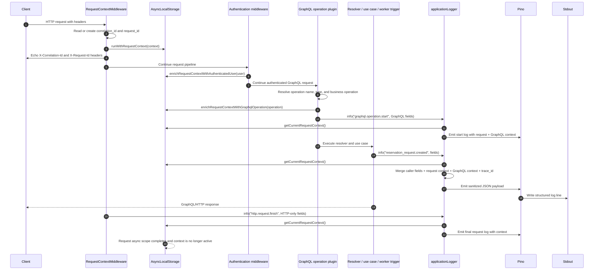

# Local Observability Workflow

The movie reservation service now emits three local observability signals:

- structured JSON logs to stdout through Pino;
- OpenTelemetry traces to an app-local collector;
- OpenTelemetry metrics to the same collector, exposed for Prometheus scraping.

Logs intentionally do not use OTLP in this phase. That keeps the service
compatible with ECS and CloudWatch, where container stdout is the normal log
contract. A local Grafana/Loki stack should collect those JSON logs from Docker
stdout, preferably with Grafana Alloy or an equivalent Docker log scraper.

The durable field-level log contract lives in
[observability-log-contract.md](../architecture/observability-log-contract.md).

## Request Context Log Enrichment

The service uses the same basic model as Python `structlog.contextvars`: request
metadata is extracted at the boundary, stored in request-local context, and then
read by the logger whenever a log line is emitted inside that async execution
flow.

In Node.js, the request-local context is implemented with `AsyncLocalStorage` in
`request-context.ts`. Pino writes the final JSON line, but enrichment happens in
the application logging wrapper before calling Pino. That keeps context handling
explicit and testable instead of requiring every call site to manually repeat
`correlation_id`, `trace_id`, `user_id`, `movie_provider_code`, or GraphQL
operation fields.



The application logger adds common request context automatically when it is
available:

- `correlation_id`
- `trace_id`
- `user_id`
- `movie_provider_code`
- `graphql_operation_name`
- `graphql_operation_type`
- `business_operation`

Transport-specific facts are still passed by the boundary that owns them. For
example, HTTP middleware passes `request_id`, `http_method`, and `http_route` to
the final HTTP request log. GraphQL operation logging binds
`graphql_operation_name`, `graphql_operation_type`, and `business_operation` to
the request-local context once Apollo has resolved the operation. Business logs
emitted after that point inherit those fields automatically.

## Correlation Contract

HTTP requests use these propagation fields:

| Field              | Owner                         | Meaning                                                                                         |
| ------------------ | ----------------------------- | ----------------------------------------------------------------------------------------------- |
| `traceparent`      | W3C/OpenTelemetry             | Trace context for spans. Preserve it across frontend, load balancer, API, and future services.  |
| `tracestate`       | W3C/OpenTelemetry/vendors     | Optional vendor trace state. Preserve it when present.                                          |
| `X-Correlation-Id` | Application/platform          | Coarser workflow id for grouping related user or business activity across traces and services.  |
| `X-Request-Id`     | Application/platform          | One HTTP request id. Useful for support/debugging when a single request needs to be referenced. |
| `X-Amzn-Trace-Id`  | AWS edge/proxy infrastructure | AWS-provided edge trace metadata. Capture it in logs; do not make it the primary app contract.  |

The API accepts caller-provided `X-Correlation-Id` and `X-Request-Id` when they
match the safe id format. Otherwise it generates fresh ids. Responses echo both
headers. Logs include correlation/request ids, authenticated identity fields,
and the active OTel `trace_id` when a span is active.

Reservation async work persists only the minimal propagation context:
`correlation_id`, `request_id`, `traceparent`, and optional `tracestate`.
GraphQL operation names and identities stay in logs/traces, not in durable work
metadata.

## Local Ports

The app-local collector uses non-default host ports so it can run next to the
sibling external Grafana stack, whose collector already publishes conventional
OTLP ports:

| Host URL                     | Container target | Use                                       |
| ---------------------------- | ---------------- | ----------------------------------------- |
| `http://localhost:14318`     | collector `4318` | Host-run Node process sends OTLP/HTTP.    |
| `localhost:14317`            | collector `4317` | Optional host OTLP/gRPC receiver.         |
| `http://localhost:18889`     | collector `8889` | Prometheus scrape endpoint for metrics.   |
| `http://otel-collector:4318` | collector `4318` | API container sends OTLP/HTTP in Compose. |

Inside Docker Compose, the API always talks to `otel-collector:4318`. Host-run
npm profiles use `localhost:14318`.

## Start Dependencies

For host-run API development with Postgres and observability:

```sh
docker compose up -d postgres
docker compose --profile observability up -d otel-collector

npm -w movie-reservation-service run db:migrate:local-postgres
npm -w movie-reservation-service run db:seed:local-postgres
npm -w movie-reservation-service run dev:local-postgres
```

If the external Grafana stack is running, Grafana uses host port `3000`. Run
the host API on another port without editing the env file:

```sh
PORT=3001 npm -w movie-reservation-service run dev:local-postgres
```

For a containerized API:

```sh
docker compose up -d postgres
docker compose --profile observability up -d otel-collector

npm -w movie-reservation-service run db:migrate:local-postgres
npm -w movie-reservation-service run db:seed:local-postgres

docker compose --profile api up -d --build api
```

The API container listens on port `3000` inside Compose, but publishes to host
port `3001` by default so it can run next to Grafana on host port `3000`.
Override `MOVIE_RESERVATION_API_HOST_PORT` if you need a different host port.

The API image runs the compiled Node app. Migrations remain explicit and are not
run as part of API startup.

## External Grafana Stack

The app-local collector forwards traces and metrics to the external stack
collector at `host.docker.internal:4317` by default. This matches the sibling
`fastapi_otel_prometheus_grafana_poc` setup, where the external collector
forwards traces to Tempo and exposes received metrics for Prometheus.

The collector forwarding endpoints live in:

```text
observability/local-collector.env
```

The default values are:

```env
OTEL_COLLECTOR_TRACE_EXPORTER_OTLP_ENDPOINT=host.docker.internal:4317
OTEL_COLLECTOR_METRIC_EXPORTER_OTLP_ENDPOINT=host.docker.internal:4317
```

The app-local collector still exposes `http://localhost:18889/metrics` as a
debugging endpoint, but the external Prometheus stack does not need to scrape
this repo directly when OTLP metric forwarding is enabled. Prometheus scrapes
the external collector inside the sibling stack instead.

For logs, configure Grafana Alloy or another Docker log scraper in the external
stack to select containers with:

```text
observability.logs=true
service.name=movie-reservation-service
```

Parse each stdout line as JSON and send it to Loki. The useful fields for
incident stitching are `trace_id`, `correlation_id`, `request_id`,
`graphql_operation_name`, `business_operation`, `user_id`, and
`movie_provider_code`. Raw propagation fields such as `traceparent`,
`tracestate`, `trace_flags`, and `parent_span_id` are intentionally not logged
by default.

Reservation worker outcome logs also include the persisted request context from
the reservation request row. The important worker events are:

| Event                                            | Meaning                                                                                |
| ------------------------------------------------ | -------------------------------------------------------------------------------------- |
| `reservation_request.processing_started`         | Worker claimed the async reservation request.                                          |
| `reservation_request.confirmed`                  | The reservation was confirmed.                                                         |
| `reservation_request.rejected`                   | The reservation was rejected, for example because a requested seat was already booked. |
| `reservation_request.processing_failed`          | The processor reached a terminal internal failure.                                     |
| `reservation_request.processing_retry_scheduled` | The processor hit a retryable internal failure.                                        |

Empty worker polls are metrics-only and are not logged at info level. `/health`
and `/ready` requests are also metrics-only at info level to avoid drowning the
business workflow in container health-check noise.

This Docker log path only sees container stdout. A host-run API process from
WebStorm or `npm -w movie-reservation-service run dev:local-postgres` can still
emit traces and metrics to the local collector, but its stdout is not scraped
by the current Alloy configuration. Run `docker compose --profile api up -d
--build api` when you want to verify logs in Loki.

Do not promote `trace_id`, `correlation_id`, or `request_id` to Loki labels.
They are high-cardinality values. Keep bounded labels such as
`service_name`, `service_environment`, `container`, and `compose_service`, then
filter JSON fields in the query.

## Smoke Check

After the API and collector are running:

```sh
npm -w movie-reservation-service run smoke:observability
```

The smoke script:

- sends `/health` with `traceparent`, `X-Correlation-Id`, and `X-Request-Id`;
- verifies the API echoes correlation and request ids;
- sends a GraphQL `movies` query;
- waits for the collector Prometheus endpoint to expose GraphQL metrics;
- prints the ids it used so logs/traces can be searched manually.

## Frontend And Load Balancer Follow-Up

The next minimal React frontend should preserve or create `traceparent`, pass
`X-Correlation-Id`, and let each backend request have its own `X-Request-Id`.
For browser debugging, the trace id can be read from the `traceparent` header in
the network tab or Playwright report.

Future ALB/ECS work should explicitly preserve `traceparent`, `tracestate`,
`X-Correlation-Id`, and `X-Request-Id`. AWS edge metadata such as
`X-Amzn-Trace-Id` should be logged for cross-checking with AWS tooling, but the
application should continue to use W3C trace context as the primary trace
contract.
